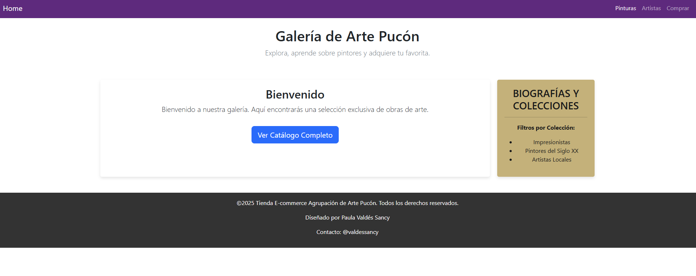
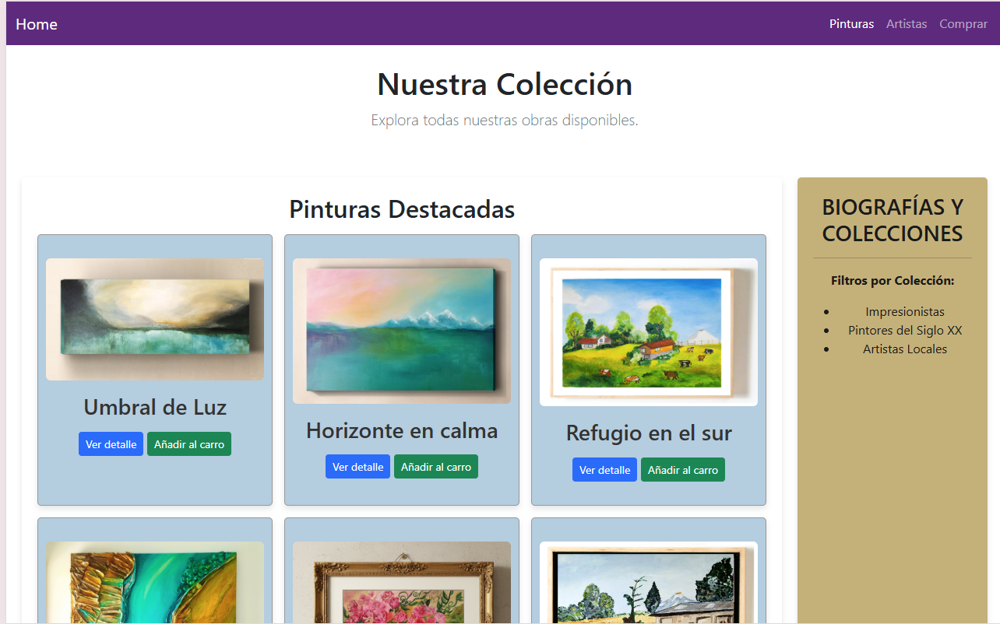

# M2 — E-commerce Frontend

## Descripción
Interfaz web de una tienda e-commerce con navegación, listado de productos, detalle y footer.

## Tecnologías
- HTML5, CSS3, JavaScript (vanilla)
- (Opcional) Bootstrap por CDN

## Ejecutar el proyecto
- Opción 1: abrir `index.html` en el navegador.
- Opción 2 (recomendada): usar una extensión de servidor local (Live Server en VS Code).

## Funcionalidades
- Navbar para navegar por la página
- Listado de productos en tarjetas con botón de compra
- Página de detalle de producto
- Footer con información de la tienda

## Capturas

## Autor
Paula Valdés Sancy - https://github.com/pvaldessancy
